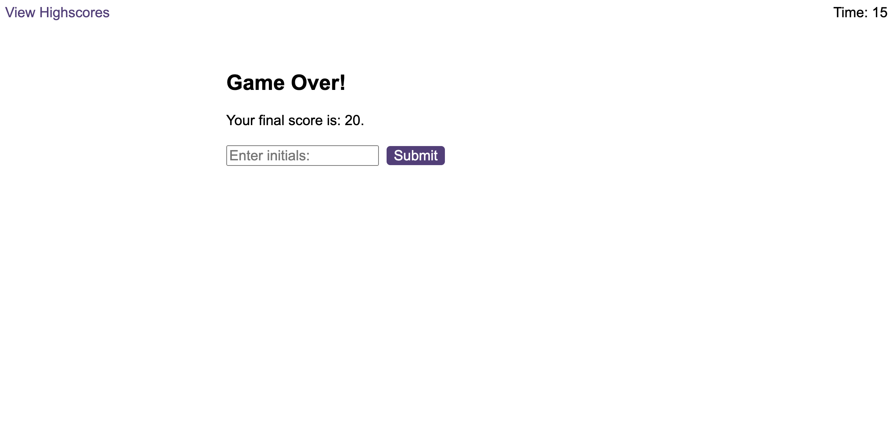

# Code-Quiz

## Description
This web page generates a timed quiz to test the user's knowledge of JavaScript fundamentals. The interactive coding challenge is powered by JavaScript with dynamically updated HTML. The developer was asked to construct the following:

-Timer function that starts when the first question is presented
-Tens seconds are subtracted from the clock if the user answers a questions 	 incorrectly
-The quiz ends after five questions or if the timer hits zero
-When the game is over, ask users to save their initials and display it on a high scores page

<!-- PROJECT -->
 

  <a href="https://pixelfobia.github.io/Code-Quiz/">
		
Visit the Github Page ->

  </a>

## Table of Contents

-Just check the console

## Screenshots
The user is greeted by a welcome message explaining the rules of the game.

After pressing the start button, the user is shown the first question and the timer starts counting down from 75.

After five questions are answered or the timer reaches 0, the user is shown a "Game Over" message and their score. The user is asked to enter their initials.

## Credits

This webpage was created while enrolled at the edX Frontend Developer Bootcamp.

## License

The last section of a high-quality README file is the license. This lets other developers know what they can and cannot do with your project. If you need help choosing a license, refer to [https://choosealicense.com/](https://choosealicense.com/).

---